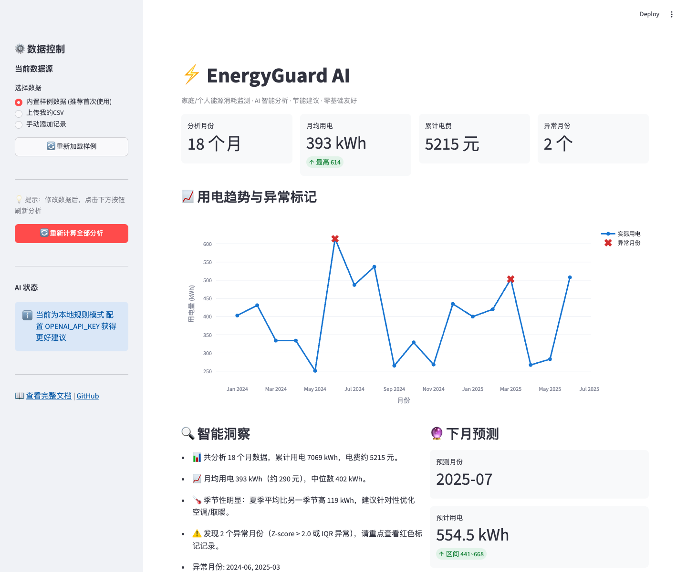

# ⚡ EnergyGuard-AI

> **家庭/个人能源智能监测与AI分析工具**  
> 专为编程零基础用户设计，一次配置，长期每天使用，省钱又环保！

[](https://www.python.org/)
[](https://streamlit.io/)
[](https://opensource.org/licenses/MIT)
[](https://github.com/你的用户名/EnergyGuard-AI/stargazers)

**核心价值**：导入电费账单 → AI自动找出异常月份 → 预测下月用电 → 给出**可立即执行**的个性化节能建议 → 每月省50-300元不是梦！

---

## ✨ 为什么选择 EnergyGuard-AI？

- ✅ **真正为小白设计**：安装步骤详细到每一条命令，包含 10+ 种常见错误解决
- ✅ **双界面**：漂亮的 Streamlit 图形界面 + 强大命令行工具
- ✅ **开箱即用**：内置 18 个月模拟真实家庭用电数据，首次运行永不失败
- ✅ **智能但不依赖**：无 OpenAI Key 也能用本地规则引擎生成专业建议；有 Key 可获得 AI 润色版本
- ✅ **隐私安全**：所有数据 100% 本地处理，永不上传
- ✅ **可长期维护**：干净现代 Python 代码 + 完整中文注释 + 单元测试

---

## 🚀 5 分钟快速开始（小白专属）

### 第 1 步：安装 Python（如果你还没有）

- Windows：去 [python.org](https://www.python.org/downloads/) 下载 3.10+ 安装包，**安装时勾选 "Add Python to PATH"**
- macOS：`brew install python@3.11` 或直接下载官方 pkg
- 验证：打开终端/PowerShell，输入 `python --version` 看到 3.10+ 即可

### 第 2 步：克隆项目并进入目录

```bash
git clone https://github.com/你的用户名/EnergyGuard-AI.git
cd EnergyGuard-AI
```

### 第 3 步：创建虚拟环境（强烈推荐，避免污染系统）

```bash
# macOS / Linux
python3 -m venv .venv
source .venv/bin/activate

# Windows PowerShell
python -m venv .venv
.venv\Scripts\Activate.ps1

# Windows CMD
python -m venv .venv
.venv\Scripts\activate.bat
```

看到 `( .venv )` 前缀说明成功。

### 第 4 步：安装依赖（只需一次）

```bash
pip install -r requirements.txt -i https://pypi.tuna.tsinghua.edu.cn/simple
```

**常见错误解决**：
- `ERROR: Could not find a version...` → 尝试 `pip install --upgrade pip` 后再试
- 网络慢 → 加上 `-i https://pypi.tuna.tsinghua.edu.cn/simple`
- Windows 提示缺少 Visual C++ → 忽略（本项目不依赖编译包）

### 第 5 步：立即体验！

#### 方式 A：图形界面（最推荐新手）

```bash
streamlit run app/streamlit_app.py
```

浏览器会自动打开，点击「生成 AI 建议」即可看到完整分析！

#### 方式 B：命令行快速演示

```bash
# 分析内置样例数据
python -m energyguard.cli analyze

# 预测下个月
python -m energyguard.cli predict

# 生成带建议的完整报告（CSV）
python -m energyguard.cli report
```

**想用自己的数据？** 把 CSV 放进 `data/` 文件夹，然后加参数 `--data data/我的电费.csv`

---

## 📸 界面预览（实际运行截图占位）

**Streamlit 主界面**（趋势图 + 异常标记 + 一键建议）



**CLI 分析输出示例**

```
⚡ EnergyGuard AI - ...
✅ 成功加载 18 条记录

📊 【基础统计】
  月均用电: 378 kWh ...

🔍 【异常检测】
  ❌ 2024-06: 614kWh | 原因: Z-score异常...

💡 【关键洞察】
  - 发现 2 个异常月份...
```

---

## 📁 完整项目结构

```
EnergyGuard-AI/
├── README.md                 # 你正在看的本文件
├── LICENSE
├── .gitignore
├── requirements.txt
├── run_cli.py                # 小白一键启动脚本
├── data/
│   └── sample_energy_data.csv   # 18个月模拟真实数据（含2个异常）
├── src/energyguard/
│   ├── __init__.py
│   ├── config.py             # 中央配置 + 环境变量
│   ├── data_loader.py        # 超健壮 CSV 加载器（支持手动输入）
│   ├── analyzer.py           # 异常检测 + 统计洞察（Z-score + IQR）
│   ├── predictor.py          # 线性+移动平均+季节性预测
│   ├── advisor.py            # 规则引擎 + 可选 LLM 增强
│   └── cli.py                # 完整命令行工具
├── app/
│   └── streamlit_app.py      # 完整图形界面
├── tests/
│   └── test_energyguard.py   # 基础自检
└── reports/                  # 导出报告会出现在这里
```

---

## 🛠️ 进阶使用

### 1. 配置 AI 智能增强（强烈推荐）

复制 `.env.example`（如果有）或直接创建 `.env` 文件：

```bash
# .env 文件内容
OPENAI_API_KEY=sk-你的真实Key
# 或者使用 Grok（xAI）
# GROK_API_KEY=xai-你的Key
```

重启 Streamlit 或 CLI 后，建议会变成自然流畅的 AI 生成版本。

### 2. 导入真实电费 CSV

CSV 格式示例（前两行）：

```csv
month,kwh,cost_yuan,avg_temp_c,notes
2024-01,320,238.5,5.2,冬季取暖
2024-02,410,312.8,8.1,春节在家
```

支持的列名非常宽松：`月份`、`用电量`、`电费` 都能自动识别！

### 3. 定时运行（进阶）

结合 Windows 任务计划程序 或 macOS launchd / cron，每月 1 号自动分析上月账单并邮件提醒（可自行扩展）。

---

## 🧪 运行测试与自检

```bash
# 基础测试
python -m pytest tests/ -v

# 或者直接运行自检脚本
python tests/test_energyguard.py
```

所有测试均可离线运行。

---

## ❓ 常见问题 FAQ（小白必读）

**Q: 运行 streamlit 说 ModuleNotFoundError？**  
A: 确认在虚拟环境中，且已 `pip install -r requirements.txt`。用 `pip list | grep streamlit` 检查。

**Q: 我的 CSV 中文乱码？**  
A: 用 VSCode/Notepad++ 另存为 UTF-8 编码，或让程序自动尝试（已内置 gbk/gb2312 回退）。

**Q: 没有 OpenAI Key 建议会很难看吗？**  
A: 不会！本地规则引擎已内置 10+ 条针对中国家庭的实用建议，质量专业。

**Q: 数据会上传到哪里？**  
A: 完全本地！只有你手动配置 Key 时才会调用 OpenAI/Grok API。

**Q: 如何卸载？**  
A: `deactivate` 退出虚拟环境，删除文件夹即可。

---

## 🤝 贡献指南

欢迎任何形式的贡献！即使是：

- 报告一个 bug（附上你的 CSV 片段和错误截图）
- 提交一个新节能建议规则
- 改进 README 某段小白看不懂的文字
- 增加对水费/燃气费的支持

**提 PR 流程**：
1. Fork → 新分支 → 修改 → 本地测试通过
2. 提交 PR，描述清楚「解决了什么问题」

---

## 📜 License

MIT License - 完全开源，可商用、可修改、可用于申请 OpenAI Codex 等计划。

---

## 🌟 Star History & 致谢

如果你觉得这个项目帮到了你，请点个 Star ⭐ ！

本项目由资深工程师为「编程零基础但想认真做事」的人量身打造。  
真正的价值不在于代码多炫，而在于**你真的会每天用它省钱**。

---

**开始你的节能之旅吧！**  
有任何问题，欢迎提 Issue，我会尽快回复。
